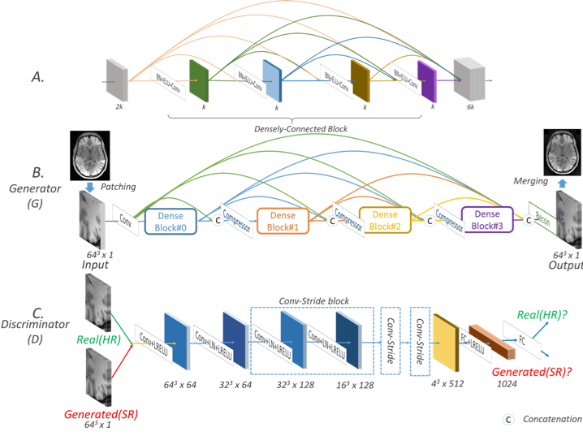
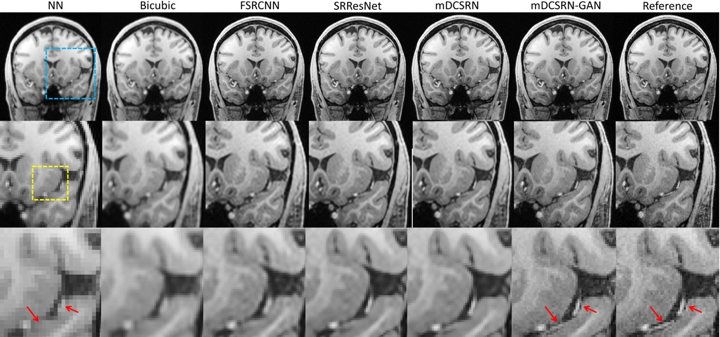

#  3D Multi-Level Densely Connected Network (mDCSRN)

This is the deployment code for multi-level densely connected super-resolution network (mDCSRN):
[Efficient and Accurate MRI Super-Resolution using a Generative Adversarial Network and
3D Multi-Level Densely Connected Network](https://arxiv.org/abs/1803.01417),
which is an early acception (<10%)  by MICCAI 2018.

In this work, we proposed a  3D neural network that it recovers 4x resolution downgraded
images and runs 6x faster than previous state-of-art Residual Super Resolution Network (SRResiNet). We further
demonstrated that by using a Generalized Adversarial Network (GAN), the mDCSRN-GAN provides an even better image quality
and is hardly distinguishable from the reference images by human eyes.

mDCSRN network:

Sample results:

Currently we are busy preparing this repository for publishing our test code for mDCSRN. We estimate the code will be
ready in one week or two. Stay tuned!

Yuhua Chen
Granada, Sep 2018

Citation:

Chen, Y., Shi, F., Christodoulou, A.G., Zhou, Z., Xie, Y. and Li, D., 2018. Efficient and Accurate MRI
Super-Resolution using a Generative Adversarial Network and 3D Multi-Level Densely Connected Network. arXiv preprint
arXiv:1803.01417.
